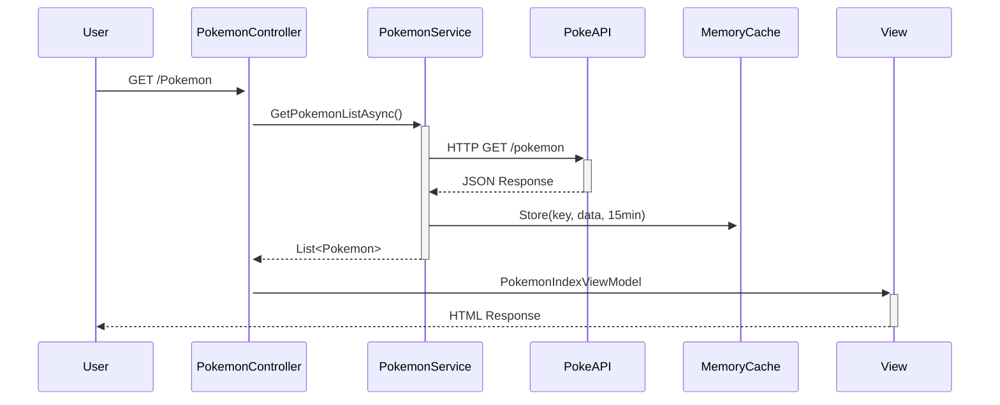
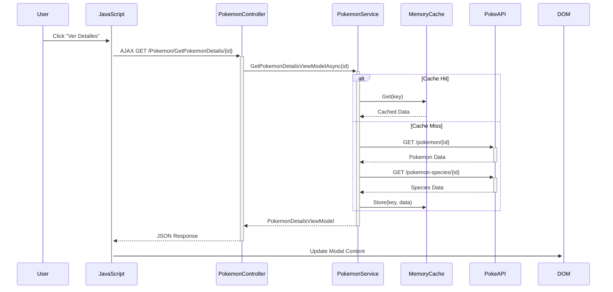

# 📋 Documentación Técnica - PokemonWebApp

## 🏗️ Arquitectura de la Aplicación

### Patrón MVC (Model-View-Controller)
```
┌─────────────────┐    ┌─────────────────┐    ┌─────────────────┐
│      VIEW       │◄───┤   CONTROLLER    │───►│     MODEL       │
│   (Razor Pages) │    │ (PokemonController)│    │  (Pokemon.cs)   │
│                 │    │                 │    │                 │
│ • Index.cshtml  │    │ • Index()       │    │ • Services      │
│ • Modal HTML    │    │ • GetDetails()  │    │ • ViewModels    │
│ • JavaScript    │    │ • Export()      │    │ • Data Models   │
└─────────────────┘    └─────────────────┘    └─────────────────┘
```

### Inyección de Dependencias
```csharp
// Program.cs - Registro de servicios
builder.Services.AddHttpClient<IPokemonService, PokemonService>();
builder.Services.AddScoped<IExcelService, ExcelService>();
builder.Services.AddScoped<IEmailService, EmailService>();
builder.Services.AddMemoryCache();

// Uso en controladores
public class PokemonController : Controller
{
    private readonly IPokemonService _pokemonService;
    
    public PokemonController(IPokemonService pokemonService)
    {
        _pokemonService = pokemonService;
    }
}
```

## 🔄 Flujo de Datos

### 1. Solicitud de Página Principal


### 2. Modal de Detalles (AJAX)


## 🗄️ Estructura de Datos

### Modelos Principales
```csharp
public class Pokemon
{
    public int Id { get; set; }
    public string Name { get; set; }
    public int Height { get; set; }        // En decímetros
    public int Weight { get; set; }        // En hectogramos
    public PokemonSprites Sprites { get; set; }
    public List<PokemonType> Types { get; set; }
    public List<PokemonAbility> Abilities { get; set; }
    public List<PokemonStat> Stats { get; set; }
}

public class PokemonSprites
{
    public string FrontDefault { get; set; }
    public PokemonOtherSprites Other { get; set; }
}

public class PokemonDetailsViewModel
{
    public Pokemon Pokemon { get; set; }
    public PokemonSpecies Species { get; set; }
    public string PrimaryTypeColor { get; set; }
    public bool IsLegendary { get; set; }
    public bool IsMythical { get; set; }
}
```

### ViewModels
```csharp
public class PokemonIndexViewModel
{
    public List<Pokemon> Pokemon { get; set; }
    public int CurrentPage { get; set; }
    public int TotalPages { get; set; }
    public string NameFilter { get; set; }
    public string TypeFilter { get; set; }
    public int? MinHeight { get; set; }
    public int? MaxHeight { get; set; }
    public List<PokemonTypeOption> AvailableTypes { get; set; }
    public List<int> AvailableHeights { get; set; }
}
```

## 🔧 Servicios y Lógica de Negocio

### PokemonService
```csharp
public class PokemonService : IPokemonService
{
    private readonly HttpClient _httpClient;
    private readonly IMemoryCache _cache;
    private readonly ILogger<PokemonService> _logger;

    // Configuración de TTL para cache
    private readonly TimeSpan _typesCacheTtl = TimeSpan.FromHours(6);
    private readonly TimeSpan _detailsCacheTtl = TimeSpan.FromMinutes(30);
    private readonly TimeSpan _speciesCacheTtl = TimeSpan.FromHours(1);
    
    // Métodos principales
    public async Task<PokemonListResponse> GetPokemonListAsync(int offset, int limit)
    public async Task<Pokemon> GetPokemonDetailsAsync(int pokemonId)
    public async Task<PokemonSpecies> GetPokemonSpeciesAsync(int speciesId)
    public async Task<List<PokemonType>> GetPokemonTypesAsync()
}
```

### ExcelService
```csharp
public class ExcelService : IExcelService
{
    public async Task<byte[]> ExportPokemonToExcelAsync(List<Pokemon> pokemon)
    {
        using var workbook = new XLWorkbook();
        var worksheet = workbook.Worksheets.Add("Pokemon");
        
        // Headers con formato
        worksheet.Cell(1, 1).Value = "ID";
        worksheet.Cell(1, 2).Value = "Nombre";
        // ... más columnas
        
        // Aplicar estilos y colores
        var headerRange = worksheet.Range(1, 1, 1, columnCount);
        headerRange.Style.Fill.BackgroundColor = XLColor.LightBlue;
        headerRange.Style.Font.Bold = true;
        
        // Datos con colores por tipo
        foreach (var pokemon in pokemonList)
        {
            var typeColor = GetTypeColor(pokemon.Types.FirstOrDefault()?.Type?.Name);
            worksheet.Cell(row, col).Style.Fill.BackgroundColor = typeColor;
        }
        
        return workbook.ToByteArray();
    }
}
```

### EmailService
```csharp
public class EmailService : IEmailService
{
    private readonly EmailSettings _emailSettings;
    private readonly ILogger<EmailService> _logger;

    public async Task<bool> SendPokemonEmailAsync(string toEmail, Pokemon pokemon)
    {
        try
        {
            using var smtpClient = new SmtpClient(_emailSettings.SmtpServer, _emailSettings.SmtpPort);
            smtpClient.EnableSsl = _emailSettings.EnableSsl;
            smtpClient.Credentials = new NetworkCredential(_emailSettings.SmtpUsername, _emailSettings.SmtpPassword);

            var mailMessage = CreatePokemonEmailMessage(toEmail, pokemon);
            await smtpClient.SendMailAsync(mailMessage);
            
            _logger.LogInformation("📧 Email enviado exitosamente para {PokemonName} a {Email}", 
                pokemon.Name, toEmail);
            return true;
        }
        catch (Exception ex)
        {
            _logger.LogError(ex, "❌ Error enviando email para {PokemonName} a {Email}", 
                pokemon.Name, toEmail);
            return false;
        }
    }
}
```

## 💾 Sistema de Cache

### Cache Server-Side (IMemoryCache)
```csharp
// Configuración en PokemonService
private string GetCacheKey(string prefix, params object[] identifiers)
{
    return $"pokemon_{prefix}_{string.Join("_", identifiers)}";
}

public async Task<T> GetFromCacheOrApiAsync<T>(string cacheKey, TimeSpan ttl, Func<Task<T>> apiCall)
{
    if (_cache.TryGetValue(cacheKey, out T cachedValue))
    {
        _logger.LogInformation("✅ Cache HIT: {CacheKey}", cacheKey);
        return cachedValue;
    }

    _logger.LogInformation("⚡ Cache MISS: {CacheKey}", cacheKey);
    var result = await apiCall();
    
    var cacheOptions = new MemoryCacheEntryOptions
    {
        AbsoluteExpirationRelativeToNow = ttl,
        SlidingExpiration = ttl > TimeSpan.FromHours(1) ? TimeSpan.FromMinutes(30) : null,
        Priority = CacheItemPriority.Normal
    };
    
    _cache.Set(cacheKey, result, cacheOptions);
    _logger.LogInformation("💾 Cache STORED: {CacheKey} (TTL: {TTL})", cacheKey, ttl);
    
    return result;
}
```

### Cache Client-Side (localStorage)
```javascript
// pokemon-cache.js
class PokemonCache {
    constructor() {
        this.prefix = 'pokemon_cache_';
        this.defaultTtl = 30 * 60 * 1000; // 30 minutos
        this.maxItems = 100;
    }

    set(key, data, ttlMs = this.defaultTtl) {
        try {
            const item = {
                data: data,
                timestamp: Date.now(),
                ttl: ttlMs
            };
            
            localStorage.setItem(this.prefix + key, JSON.stringify(item));
            this.cleanup(); // Limpieza automática
            
        } catch (e) {
            console.warn('Cache storage failed:', e);
            this.clearOldest(); // Si está lleno, eliminar más antiguo
        }
    }

    get(key) {
        try {
            const item = localStorage.getItem(this.prefix + key);
            if (!item) return null;

            const parsed = JSON.parse(item);
            const now = Date.now();
            
            if (now - parsed.timestamp > parsed.ttl) {
                localStorage.removeItem(this.prefix + key);
                return null;
            }
            
            return parsed.data;
        } catch (e) {
            return null;
        }
    }
}

// Uso global
window.pokemonCache = new PokemonCache();
```

## 🛡️ Manejo de Errores

### Middleware Global
```csharp
public class GlobalExceptionHandlingMiddleware
{
    private readonly RequestDelegate _next;
    private readonly ILogger<GlobalExceptionHandlingMiddleware> _logger;

    public async Task InvokeAsync(HttpContext context)
    {
        try
        {
            await _next(context);
        }
        catch (Exception ex)
        {
            _logger.LogError(ex, "💀 Excepción no manejada en {RequestPath}", context.Request.Path);
            
            await HandleExceptionAsync(context, ex);
        }
    }

    private async Task HandleExceptionAsync(HttpContext context, Exception exception)
    {
        var correlationId = Guid.NewGuid().ToString();
        
        var response = new
        {
            error = new
            {
                message = GetUserFriendlyMessage(exception),
                correlationId = correlationId,
                timestamp = DateTime.UtcNow
            }
        };

        context.Response.StatusCode = GetStatusCode(exception);
        context.Response.ContentType = "application/json";

        await context.Response.WriteAsync(JsonSerializer.Serialize(response));
    }
}
```

### Páginas de Error Personalizadas
```csharp
public class ErrorController : Controller
{
    public IActionResult Index(int? statusCode = null)
    {
        var errorViewModel = new ErrorViewModel
        {
            StatusCode = statusCode ?? 500,
            Title = GetErrorTitle(statusCode),
            Message = GetErrorMessage(statusCode),
            ShowDetails = _env.IsDevelopment()
        };

        return View(errorViewModel);
    }

    private string GetErrorTitle(int? statusCode) => statusCode switch
    {
        404 => "🔍 Página no encontrada",
        500 => "⚠️ Error interno del servidor",
        503 => "🚧 Servicio no disponible",
        _ => "❌ Error inesperado"
    };
}
```

## 📊 Logging y Monitoreo

### Configuración de Serilog
```csharp
Log.Logger = new LoggerConfiguration()
    .MinimumLevel.Information()
    .MinimumLevel.Override("Microsoft", LogEventLevel.Warning)
    .Enrich.FromLogContext()
    .Enrich.WithMachineName()
    .Enrich.WithProcessId()
    .Enrich.WithThreadId()
    .WriteTo.Console(outputTemplate: "[{Timestamp:HH:mm:ss} {Level:u3}] {SourceContext}: {Message:lj}{NewLine}{Exception}")
    .WriteTo.File(
        path: "Logs/pokemon-app-.log",
        rollingInterval: RollingInterval.Day,
        retainedFileCountLimit: 7)
    .CreateLogger();
```

### Métricas de Rendimiento
```csharp
public async Task<IActionResult> Index(/* parámetros */)
{
    var stopwatch = Stopwatch.StartNew();
    
    try
    {
        _logger.LogInformation("🎯 Cargando página de Pokémon - Página: {CurrentPage}, Filtros aplicados", currentPage);
        
        // Lógica del método...
        
        stopwatch.Stop();
        _logger.LogInformation("✅ Página de Pokémon cargada exitosamente en {ElapsedMs}ms", stopwatch.ElapsedMilliseconds);
        
        return View(viewModel);
    }
    catch (Exception ex)
    {
        stopwatch.Stop();
        _logger.LogError(ex, "❌ Error cargando página de Pokémon en {ElapsedMs}ms", stopwatch.ElapsedMilliseconds);
        throw;
    }
}
```

## 🔌 Integración con APIs Externas

### Configuración de HttpClient
```csharp
// Program.cs
builder.Services.AddHttpClient<IPokemonService, PokemonService>(client =>
{
    client.BaseAddress = new Uri("https://pokeapi.co/api/v2/");
    client.Timeout = TimeSpan.FromSeconds(30);
    client.DefaultRequestHeaders.Add("User-Agent", "PokemonWebApp/1.0");
});

// Políticas de retry (opcional)
builder.Services.AddHttpClient<IPokemonService, PokemonService>()
    .AddPolicyHandler(GetRetryPolicy());

static IAsyncPolicy<HttpResponseMessage> GetRetryPolicy()
{
    return HttpPolicyExtensions
        .HandleTransientHttpError()
        .WaitAndRetryAsync(
            retryCount: 3,
            sleepDurationProvider: retryAttempt => TimeSpan.FromSeconds(Math.Pow(2, retryAttempt)));
}
```

### Deserialización JSON
```csharp
// Configuración personalizada para propiedades snake_case
public class PokemonService : IPokemonService
{
    private readonly JsonSerializerSettings _jsonSettings = new JsonSerializerSettings
    {
        PropertyNameCaseInsensitive = true,
        ContractResolver = new DefaultContractResolver
        {
            NamingStrategy = new SnakeCaseNamingStrategy()
        },
        NullValueHandling = NullValueHandling.Ignore
    };

    private async Task<T> DeserializeAsync<T>(HttpResponseMessage response)
    {
        var content = await response.Content.ReadAsStringAsync();
        return JsonConvert.DeserializeObject<T>(content, _jsonSettings);
    }
}
```

## 🎨 Frontend y UX

### JavaScript Modular
```javascript
// Estructura del archivo pokemon-cache.js
const PokemonApp = {
    cache: new PokemonCache(),
    ui: {
        showLoading: (element) => { /* ... */ },
        hideLoading: (element) => { /* ... */ },
        showError: (message) => { /* ... */ }
    },
    
    async loadPokemonDetails(pokemonId) {
        const cacheKey = `details_${pokemonId}`;
        let data = this.cache.get(cacheKey);
        
        if (!data) {
            this.ui.showLoading('#pokemonModal .modal-body');
            
            try {
                const response = await fetch(`/Pokemon/GetPokemonDetails/${pokemonId}`);
                data = await response.json();
                
                if (data.success) {
                    this.cache.set(cacheKey, data);
                } else {
                    throw new Error(data.message);
                }
            } catch (error) {
                this.ui.showError('Error cargando detalles del Pokémon');
                return;
            } finally {
                this.ui.hideLoading('#pokemonModal .modal-body');
            }
        }
        
        this.renderPokemonDetails(data.pokemon);
    }
};
```

### CSS y Responsividad
```css
/* Colores por tipo de Pokémon */
:root {
    --type-normal: #A8A878;
    --type-fire: #F08030;
    --type-water: #6890F0;
    --type-electric: #F8D030;
    --type-grass: #78C850;
    /* ... más tipos */
}

/* Grid responsivo */
.pokemon-grid {
    display: grid;
    grid-template-columns: repeat(auto-fill, minmax(300px, 1fr));
    gap: 1.5rem;
    padding: 1rem;
}

@media (max-width: 768px) {
    .pokemon-grid {
        grid-template-columns: 1fr;
        gap: 1rem;
    }
    
    .pokemon-card {
        margin: 0 0.5rem;
    }
}

/* Animaciones */
.pokemon-card {
    transition: transform 0.2s ease, box-shadow 0.2s ease;
}

.pokemon-card:hover {
    transform: translateY(-4px);
    box-shadow: 0 8px 25px rgba(0, 0, 0, 0.15);
}
```

## 🚀 Optimizaciones de Rendimiento

### Lazy Loading de Imágenes
```javascript
// Implementación en las cards de Pokémon
const lazyImages = document.querySelectorAll('img[data-src]');
const imageObserver = new IntersectionObserver((entries, observer) => {
    entries.forEach(entry => {
        if (entry.isIntersecting) {
            const img = entry.target;
            img.src = img.dataset.src;
            img.classList.remove('lazy');
            imageObserver.unobserve(img);
        }
    });
});

lazyImages.forEach(img => imageObserver.observe(img));
```

### Paginación Eficiente
```csharp
public async Task<PokemonListResponse> GetPokemonListAsync(int offset, int limit)
{
    // Cache de la lista principal por página
    var cacheKey = GetCacheKey("list", offset, limit);
    
    return await GetFromCacheOrApiAsync(cacheKey, _listCacheTtl, async () =>
    {
        var url = $"pokemon?offset={offset}&limit={limit}";
        var response = await _httpClient.GetAsync(url);
        response.EnsureSuccessStatusCode();
        
        return await DeserializeAsync<PokemonListResponse>(response);
    });
}
```

## 🔄 Deployment y CI/CD

### Configuración para Producción
```csharp
// Program.cs - Configuraciones específicas para producción
if (app.Environment.IsProduction())
{
    // Configuraciones de seguridad
    app.UseHsts();
    app.UseHttpsRedirection();
    
    // Configuraciones de rendimiento
    app.UseResponseCompression();
    app.UseResponseCaching();
    
    // Logging mínimo
    builder.Logging.SetMinimumLevel(LogLevel.Warning);
}
```

### Variables de Entorno
```bash
# Archivo .env para desarrollo local (NO incluir en Git)
ASPNETCORE_ENVIRONMENT=Development
SMTP_SERVER=smtp.gmail.com
SMTP_PORT=587
SMTP_USERNAME=your-email@gmail.com
SMTP_PASSWORD=your-app-password
FROM_EMAIL=your-email@gmail.com
```

## 📈 Métricas y Análisis

### Estadísticas de Cache
```csharp
public class PokemonService : IPokemonService
{
    private int _cacheHits = 0;
    private int _cacheMisses = 0;

    public CacheStatistics GetCacheStats()
    {
        return new CacheStatistics
        {
            TotalRequests = _cacheHits + _cacheMisses,
            CacheHits = _cacheHits,
            CacheMisses = _cacheMisses,
            HitRate = _cacheHits + _cacheMisses > 0 
                ? (double)_cacheHits / (_cacheHits + _cacheMisses) * 100 
                : 0
        };
    }
}
```

## 🧪 Testing Guidelines

### Unit Tests Structure
```csharp
[TestClass]
public class PokemonServiceTests
{
    private Mock<HttpClient> _mockHttpClient;
    private Mock<IMemoryCache> _mockCache;
    private Mock<ILogger<PokemonService>> _mockLogger;
    private PokemonService _service;

    [TestInitialize]
    public void Setup()
    {
        _mockHttpClient = new Mock<HttpClient>();
        _mockCache = new Mock<IMemoryCache>();
        _mockLogger = new Mock<ILogger<PokemonService>>();
        
        _service = new PokemonService(_mockHttpClient.Object, _mockCache.Object, _mockLogger.Object);
    }

    [TestMethod]
    public async Task GetPokemonDetailsAsync_WithValidId_ReturnsExpectedPokemon()
    {
        // Arrange
        var expectedPokemon = new Pokemon { Id = 1, Name = "bulbasaur" };
        
        // Act
        var result = await _service.GetPokemonDetailsAsync(1);
        
        // Assert
        Assert.AreEqual(expectedPokemon.Name, result.Name);
    }
}
```

## 🔍 Debugging Tips

### Herramientas de Desarrollo
```javascript
// Funciones de debugging disponibles en la consola del navegador
window.pokemonDebug = {
    clearCache: () => localStorage.clear(),
    getCacheStats: () => window.pokemonCache.getStats(),
    toggleCacheLogging: () => window.pokemonCache.toggleLogging(),
    simulateSlowNetwork: (delay = 2000) => {
        // Simular red lenta para testing
    }
};
```

### Logs de Desarrollo
```csharp
#if DEBUG
    _logger.LogDebug("🔧 Debug: Cache key generado: {CacheKey} para Pokemon ID: {PokemonId}", 
        cacheKey, pokemonId);
#endif
```

---

## 📚 Referencias y Recursos

- **[ASP.NET Core Documentation](https://docs.microsoft.com/en-us/aspnet/core/)**
- **[PokéAPI Documentation](https://pokeapi.co/docs/v2)**
- **[Serilog Documentation](https://serilog.net/)**
- **[ClosedXML Documentation](https://github.com/ClosedXML/ClosedXML/wiki)**
- **[Bootstrap 5 Documentation](https://getbootstrap.com/docs/5.0/)**

---

*Última actualización: Junio 2025*